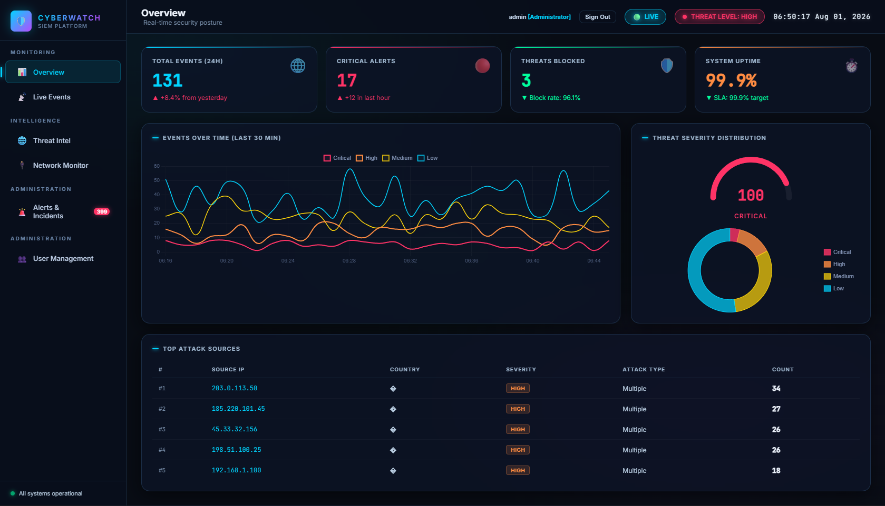
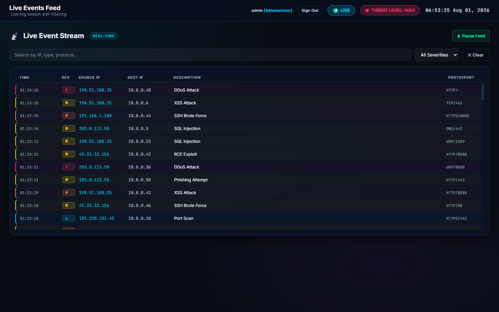
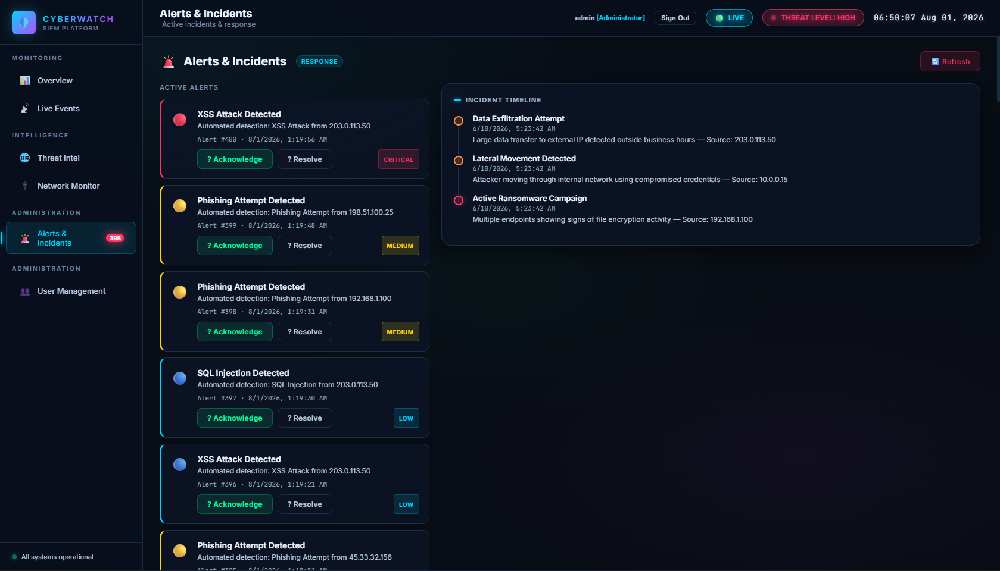
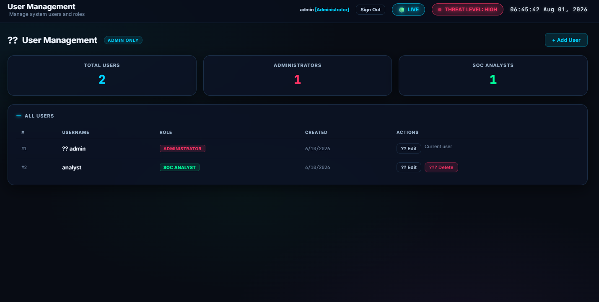

# CyberWatch SIEM Dashboard

A real-time Security Information and Event Management (SIEM) dashboard built for cybersecurity monitoring, threat detection, and incident response.

  

---

## Overview

CyberWatch is a full-featured SIEM dashboard that provides security teams with real-time visibility into their environment. It simulates a production-grade SOC (Security Operations Center) interface with live event streaming, threat intelligence, and incident response workflows.

---

## Features

- **Real-time Event Streaming** — Live security event feed via WebSocket with automatic demo fallback
- **Threat Intelligence** — Global attack map, CVE feed, and threat category analysis
- **Network Monitor** — Traffic analysis, protocol distribution, and port scan detection
- **Alerts & Incidents** — Active alert management with acknowledge and resolve workflows
- **Role-Based Access** — Admin and SOC Analyst roles with different access levels
- **Interactive Charts** — Severity distribution, event timeline, and traffic charts powered by Chart.js
- **Login & Auth** — Session-based authentication with localStorage token management

---

## Tech Stack

| Layer | Technology |
|-------|-----------|
| Frontend | HTML5, CSS3, Vanilla JavaScript |
| Charts | Chart.js 4.4 |
| Backend (optional) | Python, FastAPI |
| Containerization | Docker, Docker Compose |
| Web Server | Nginx |

---

## Getting Started

### Run Locally (No Backend Required)

The dashboard works fully in demo mode without a backend.

1. Clone the repository:
```bash
git clone https://github.com/Silwalkg/cyberwatch-siem.git
cd cyberwatch-siem
```

2. Open `login.html` in your browser

3. Login with any credentials:
   - Username: `admin` → Administrator role
   - Username: `analyst` → SOC Analyst role
   - Password: anything

### Run with Backend

1. Copy the env template and set a real secret key:
```bash
cd backend
cp .env.example .env
# Edit .env — set SECRET_KEY to a long random string
# Set DEMO_MODE=true if you want to allow any password (dev only)
```

2. Install dependencies and start:
```bash
pip install -r requirements.txt
uvicorn main:app --reload
```

### Run with Docker

1. Create a `.env` file in the project root with your secret key:
```bash
echo "SECRET_KEY=$(python -c 'import secrets; print(secrets.token_hex(32))')" > .env
echo "DEMO_MODE=true" >> .env
```

2. Build and start:
```bash
docker-compose up --build
```

Then open `http://localhost` in your browser.

The setup runs two containers: the FastAPI backend and an Nginx frontend. The SQLite database is stored on a named Docker volume so data persists across restarts.

---

## Project Structure

```
cyberwatch-siem/
├── index.html              # Main dashboard
├── login.html              # Login page
├── css/
│   └── style.css           # Design system & component styles
├── js/
│   ├── data.js             # Mock data, Auth, LiveFeed, API wrappers
│   └── dashboard.js        # App logic, routing, charts, WebSocket
├── backend/                # FastAPI backend (optional)
│   ├── main.py             # API routes & WebSocket feed
│   ├── auth.py             # JWT auth (SECRET_KEY via env var)
│   ├── database.py         # SQLAlchemy models & seed data
│   └── .env.example        # Environment variable template
├── nginx.conf              # Nginx configuration
└── docker-compose.yml      # Docker setup
```

---

## Pages

| Page | Description |
|------|-------------|
| Overview | KPI cards, event timeline, severity distribution, top attackers |
| Live Events | Real-time event log with search and severity filtering |
| Threat Intel | Global attack map, CVE feed, threat categories |
| Network Monitor | Traffic chart, protocol analysis, port scan detections |
| Alerts & Incidents | Active alerts with acknowledge/resolve, incident timeline |

---

## Demo Credentials

| Username | Password | Role |
|----------|----------|------|
| admin | any | Administrator |
| analyst | any | SOC Analyst |

> In demo mode, any non-empty password is accepted.

---

## Screenshots









---

## License

This project is licensed under the MIT License. See [LICENSE](LICENSE) for details.

## API Endpoints

| Method | Endpoint | Description |
|--------|----------|-------------|
| GET | /api/health | Health check |
| POST | /api/auth/token | Login, get JWT |
| GET | /api/events | Security events |
| GET | /api/events/stats | Event statistics |
| GET | /api/alerts | Active alerts |
| PATCH | /api/alerts/{id} | Update alert |
| GET | /api/incidents | Open incidents |
| GET | /api/dashboard/summary | KPI summary |
| GET | /api/users | List users (admin only) |
| POST | /api/users | Create user (admin only) |
| PATCH | /api/users/{id} | Edit user (admin only) |
| DELETE | /api/users/{id} | Delete user (admin only) |
| WS | /ws/events | Live WebSocket feed |

---

## Author

**Kulan Silwalkg**
[GitHub](https://github.com/Silwalkg)


